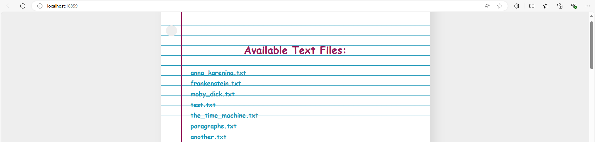
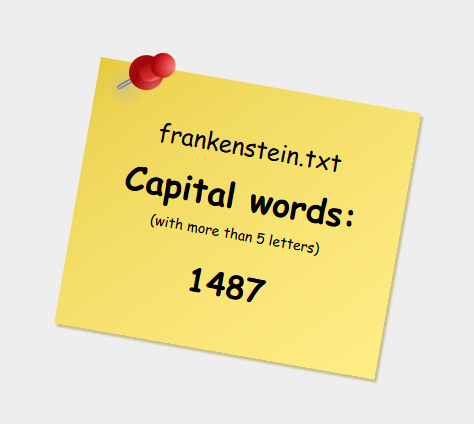

# About the Project

This project is an upgraded version of <a href="https://github.com/sic-mundus-creatus-est/sysprog-project-one">the previous one</a>, utilizing `tasks` and `async programming` instead of raw threads. The core assignment remains the same: counting words in a text file that start with an uppercase letter and contain more than five characters. Each HTTP request is managed by a separate task. `Tasks` offer superior throughput by efficiently handling concurrent operations without immediate termination upon completion. They enable better resource utilization, improved responsiveness, and more efficient handling of concurrent operations compared to raw threads. The caching mechanism remains a simple `LRU` implementation, adapted for task-based and async operations.

Visual interface was created solely for testing. Homepage displays a list of *all* text files located in the root directory and its subdirectories. The root folder path can be modified in Program.cs file.

- The word count of a file can be requested either by clicking on its name from the homepage or by entering the file name in the URL, for example: `http://localhost:18859/example.txt`

    
    
After requesting the word count for an existing file, the response will display the word count stylized as a note pictured below:

    

